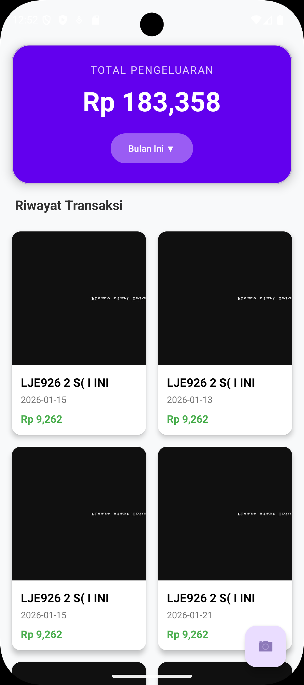
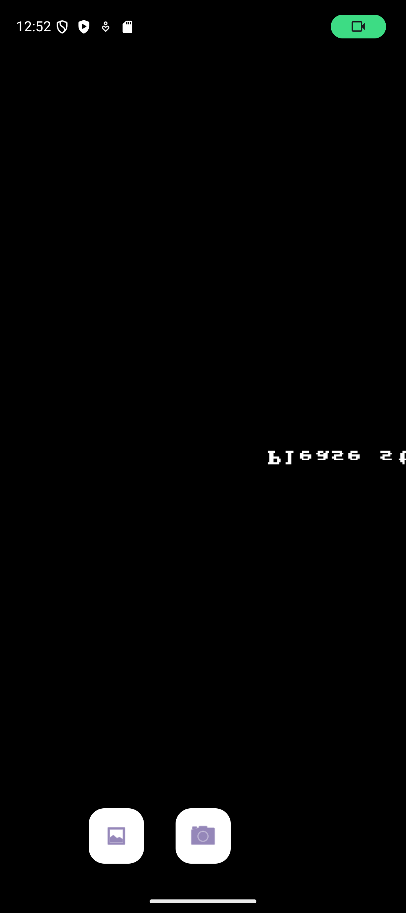
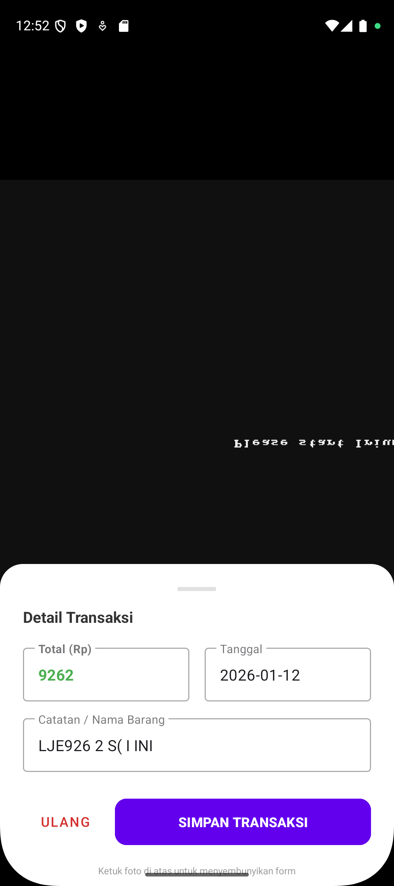
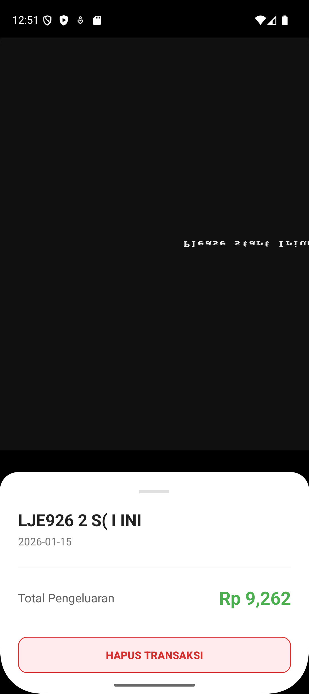

# 💸 Save Transaction App (Pencatat Pengeluaran Pintar)

Aplikasi Android pencatat pengeluaran otomatis berbasis **AI (Artificial Intelligence)**. Aplikasi ini memudahkan pengguna untuk mendigitalkan struk belanja hanya dengan sekali foto.

---

## 📱 Fitur Unggulan

✅ Smart Scan (OCR): Menggunakan **Google ML Kit** untuk membaca teks pada struk secara otomatis. Aplikasi cerdas mendeteksi:
   - **Total Belanja**
   - **Tanggal Transaksi**
   - **Nama Barang/Catatan**
   
✅ **Dual Input Mode**: Bisa ambil foto langsung dari **Kamera** atau upload dari **Galeri**.
✅ **Cloud Storage**: Semua data tersimpan aman di **Firebase Firestore** (Realtime & Online).
✅ **Filter Canggih**: Lihat riwayat pengeluaran berdasarkan:
   - Bulan Ini
   - Bulan Lalu
   - Rentang Tanggal Khusus (Custom Date Range)
✅ **Detail & Zoom**: Melihat bukti foto struk dengan fitur *pinch-to-zoom* dan opsi hapus data.

---

## 🛠️ Teknologi & Library

Aplikasi ini dibangun menggunakan teknologi modern Android Development:

* **Bahasa**: Java (Native)
* **Minimum SDK**: Android 8.0 (Oreo)
* **Database**: Firebase Firestore
* **Computer Vision**: Google ML Kit (Text Recognition)
* **Camera**: Android CameraX
* **Image Loading**: Glide
* **Image Zoom**: PhotoView
* **UI Components**: Material Design 3 & CardView

---

## 📸 Screenshots

| Dashboard Utama | Mode Scan Kamera | Hasil Scan (AI) | Detail Transaksi |
|:---:|:---:|:---:|:---:|
|  |  |  |  |

*(Catatan: Ganti `screenshots/nama_file.jpg` dengan lokasi foto aplikasi kamu)*

---

## 🚀 Cara Instalasi

1.  **Clone Repository** ini ke komputer kamu.
    ```bash
    git clone [https://github.com/Geoleno/SaveTransactionApp.git](https://github.com/Geoleno/SaveTransactionApp.git)
    ```
2.  Buka project di **Android Studio**.
3.  **PENTING**: Tambahkan file `google-services.json` milikmu ke dalam folder `app/`.
    > File ini dibutuhkan untuk koneksi ke Firebase.
4.  Tunggu proses **Gradle Sync** selesai.
5.  Jalankan aplikasi di Emulator atau HP fisik.

---

## 👨‍💻 Author

Mahasiswa Computer Science - Universitas Bina Nusantara 
GitHub: [@Geoleno](https://github.com/Geoleno)

---

Copyright © 2026. All Rights Reserved.
